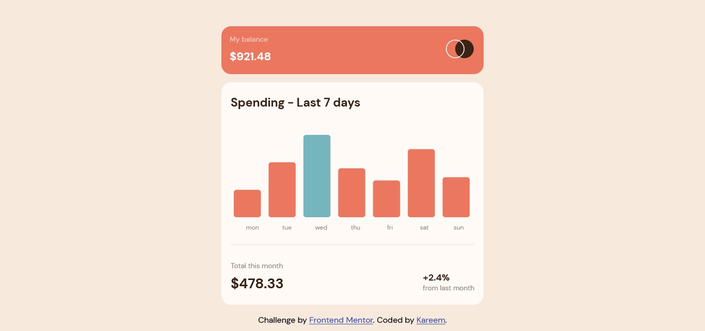

# Frontend Mentor - Expenses chart component solution

This is a solution to the [Expenses chart component challenge on Frontend Mentor](https://www.frontendmentor.io/challenges/expenses-chart-component-e7yJBUdjwt). Frontend Mentor challenges help you improve your coding skills by building realistic projects.

## Table of contents

- [Overview](#overview)
  - [The challenge](#the-challenge)
  - [Screenshot](#screenshot)
  - [Links](#links)
- [My process](#my-process)
  - [Built with](#built-with)
  - [What I learned](#what-i-learned)
  - [Continued development](#continued-development)
  - [Useful resources](#useful-resources)
- [Author](#author)
- [Acknowledgments](#acknowledgments)

**Note: Delete this note and update the table of contents based on what sections you keep.**

## Overview

### Screenshot

### Links

- Solution URL: [Solution Url](https://github.com/talentlessDeveloper/expense-chart)
- Live Site URL: [Live Site](https://talentlessdeveloper.github.io/expense-chart)

## My process

### Built with

- Semantic HTML5 markup
- CSS custom properties
- Flexbox
- Mobile-first workflow
- [D3](https://d3js.org/) - JS library

### What I learned

Using d3 to create a bar chart for data visualization.

### Continued development

To learn more data visualization and improve upon my knowledge.

### Useful resources

- [Example resource 1](https://d3js.org/) - This helped me for XYZ reason. I really liked this pattern and will use it going forward.

## Author

- Frontend Mentor - [@talentlessDeveloper](https://www.frontendmentor.io/profile/talentlessDeveloper)
- Twitter - [@talentless_dev](https://www.twitter.com/talentless_dev)
